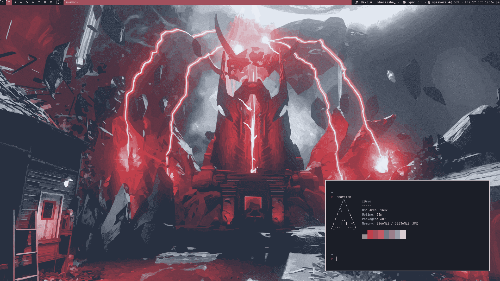

# dotfiles
dotfiles for my arch linux system

my builds for dwm, dwmblocks, st and my scripts are in their own seperate repos

## system

- audio - `pulseaudio` + `pavucontrol` + `playerctl`
- colours - `pywal`
- editor - `nvim`
- icons - `papirus dark`
- music - `pywal`
- notifications - `dunst`
- shell - `zsh` + `ohmyzsh` + `starship`

## to-do

- configure picom
- configure mpd with a music player

